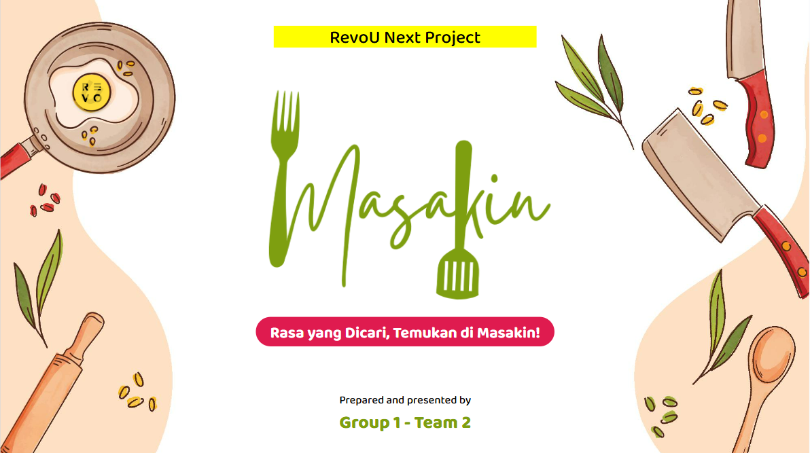

<p align="center">
  <a href="" target="blank">
  
  </a>
</p>

[circleci-image]: https://img.shields.io/circleci/build/github/nestjs/nest/master?token=abc123def456
[circleci-url]: https://circleci.com/gh/nestjs/nest

</p>

# Masakin

Masakin is a feature-rich application designed to provide a wide variety of food recipes. Built with a robust technology stack, Masakin ensures a secure, efficient, and user-friendly experience.

## Technologies Used

- **Framework**: [NestJS](https://nestjs.com/)
- **Database**: [PostgreSQL](https://www.postgresql.org/)
- **Authentication**: [JSON Web Tokens (JWT)](https://jwt.io/)
- **API Documentation**: [Swagger UI](https://swagger.io/tools/swagger-ui/)

## Key Features

- **Diverse Recipe Collection**: Browse through an extensive list of recipes from various cuisines.
- **Secure Authentication**: User authentication is managed with JWT to ensure secure access.
- **Comprehensive API Documentation**: Easily explore and test the API endpoints through Swagger UI.
- **Scalable Architecture**: Built with NestJS, the application is designed to be modular and maintainable.

## Getting Started

To get a local copy up and running, follow these steps:

1. **Clone the repository**:

   ```bash
   git clone https://github.com/your-username/masakin.git
   ```

2. **Navigate to the project directory**:

   ```bash
   cd masakin
   ```

3. **Install dependencies**:

   ```bash
   npm install
   ```

4. **Set up the PostgreSQL database** and configure the connection in the `.env` file.

5. **Run the application**:

   ```bash
   npm run start:dev
   ```

6. **Access the API documentation**:
   Open your browser and navigate to `http://localhost:3000/api`.
